**Difficulty:** Medium

**OS:** Linux

**IP:** 10.129.244.184

**Date:** 21/02/2026

We will begin this machine by using Nmap to scan the server for all open TCP ports:

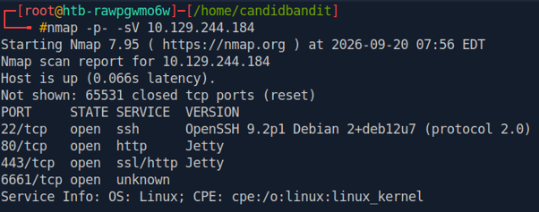

Visiting the webserver on port 443, we find a Mirth Connect instance.  Clicking the Launch Mirth Connect Administrator initiates a download of the file webstart.jnlp.

Viewing webstart.jnlp using vim, reveals that we are working with Mirth Connect Administrator 4.4.0:
 
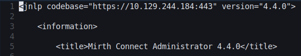

Searching for exploits related to this version of Mirth Connect returns the following exploit:

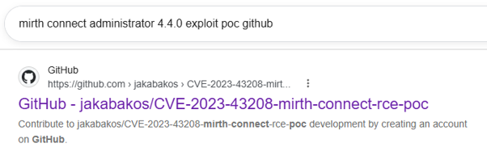

Preparing and executing the payload provides us with a shell on the server:

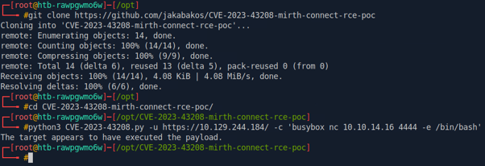

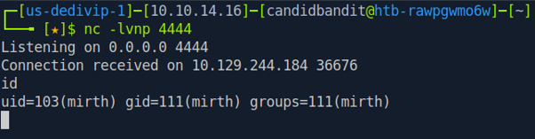

We then use the following commands to stabilize the shell:

python3 -c ‘import pty;pty.spawn(“/bin/bash”)’

export TERM=xterm

ctrl-z

stty raw -echo; fg

At this point we want to identify any related files of interest for the underlying Mirth Connect technology. After some research we discover the following file which contains database credentials:

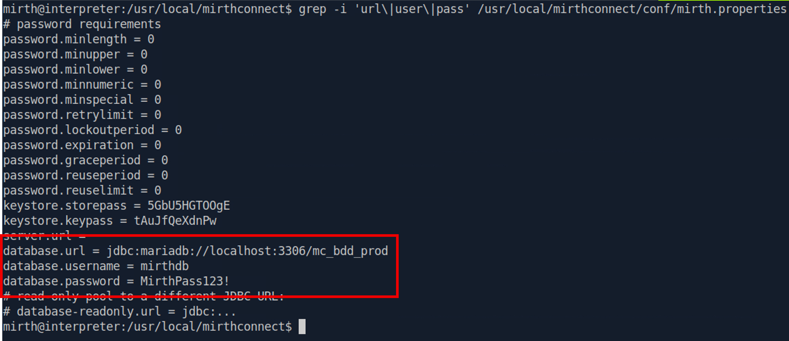

Using ss, we discover that there is a running SQL server on port 3306:

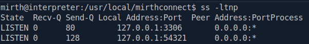

With this information, we connect to the SQL server using MariaDB:

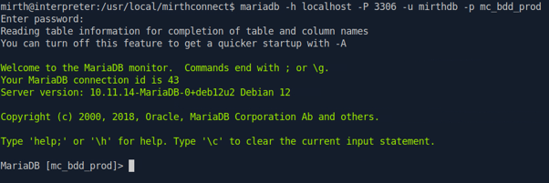

Next, we enumerate the database and discover an encrypted password:

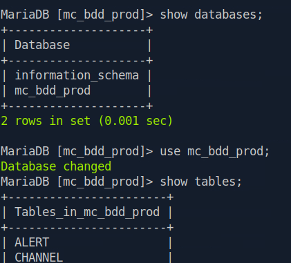

[...]

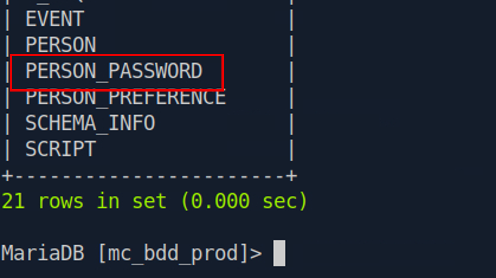

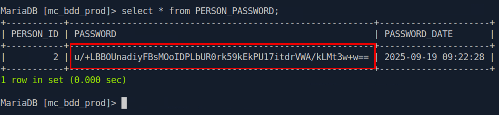

Using AI to research the encrypted password, we discover that it uses the PBKDF2-HMAC-SHA256 algorithm:

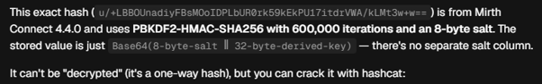

We can recover the plaintext value by splitting the ciphertext into a base64 salt and a base64 hash:

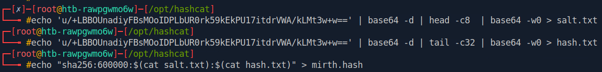

And then running Hashcat using mode 10900:

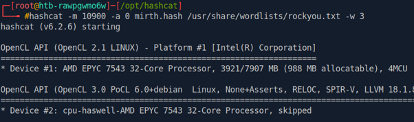

Which eventually identifies the plaintext password:

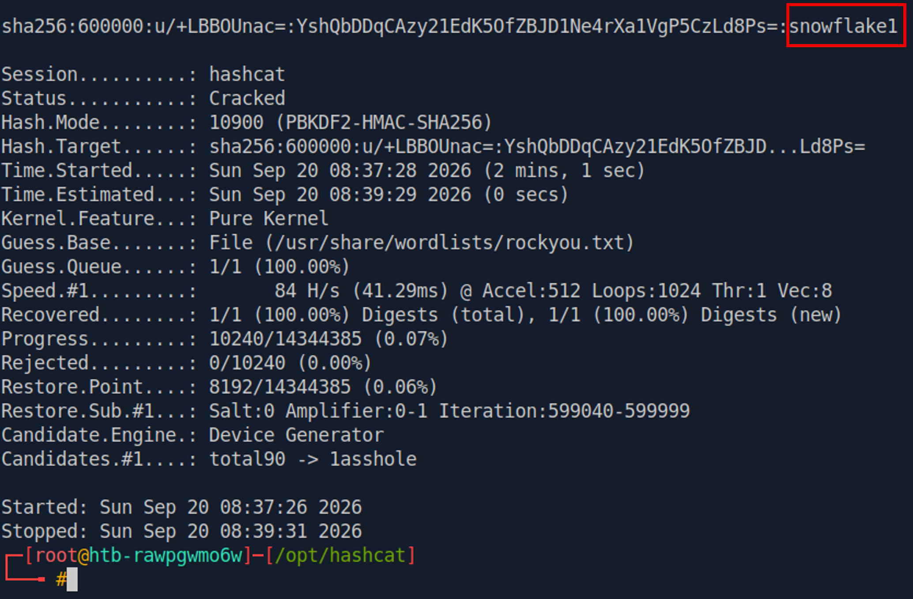

With this, we can now use SSH to log into the system as the Sedric user:

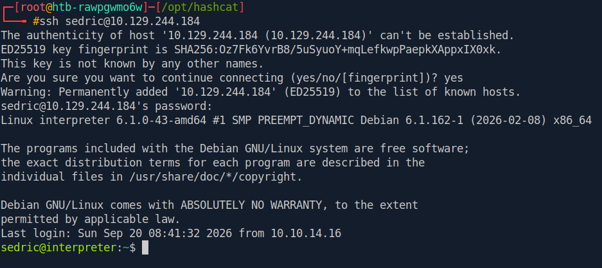

Listing the running root processes, we discover the unusual file notif.py:

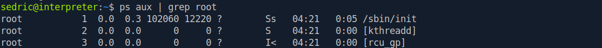

[…]

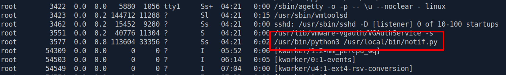

This reveals an application running locally on port 54321:

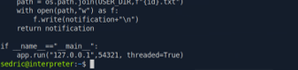

We will therefore port forward to access the application locally:

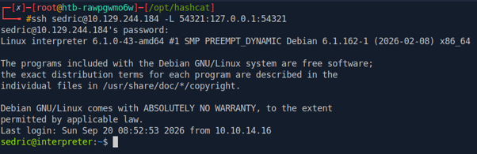

Looking closely at the code, we discover that the application is using eval:

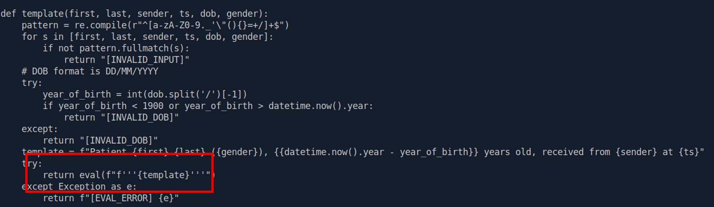

Eval is dangerous because it executes strings as if they are programming code. Leveraging this, we can craft some exploit code, possibly using AI, to exploit this script and elevate ourselves to the root user. First, we will test our hypothesis to see if we can actually execute Python code:

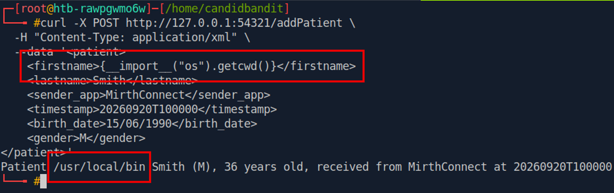

This proves successful, however, regex is preventing us from entering certain characters, including a space. This prevents us from executing a reverse shell:

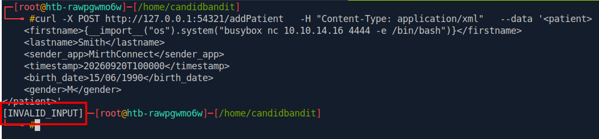

A solution here is to use a Base64 encoded payload and then decode and execute the contents in the code block:

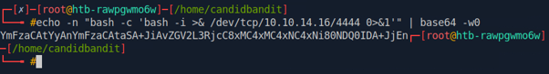

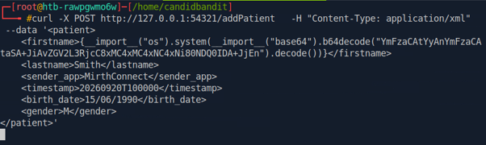

The code successfully executes and we catch a root shell on our listener:

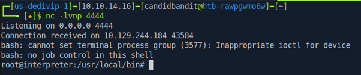
